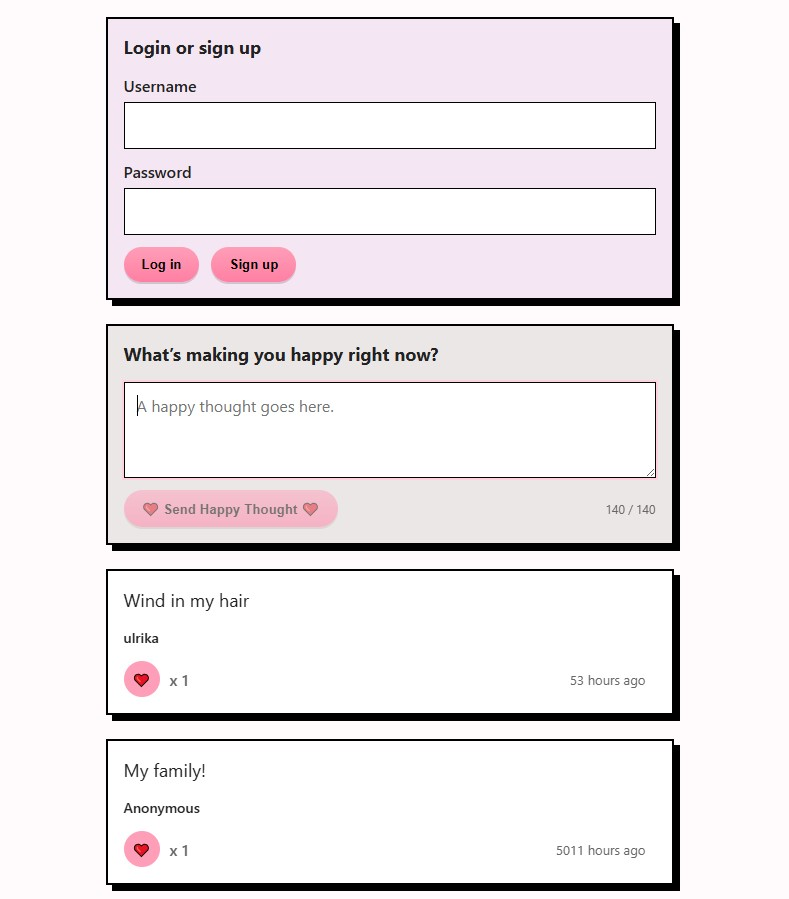

# 💖 Happy Thoughts

> _“Sharing happiness, one thought at a time.”_

A joyful mini social feed built with **React**, **Vite**, and **styled-components**.  
Happy Thoughts lets users post short positive messages, like others’ posts, and spread a bit of joy — now backed by a **custom REST API with authentication**.

🌐 **Live demo:** https://thinkhappy.netlify.app

---

## 🖼️ Preview



---

## ✨ Features

- 💬 Post short thoughts (5–140 characters)
- ❤️ Like thoughts (authentication required)
- 🕒 See how long ago each thought was posted
- 🔐 Sign up and log in with username + password
- 🧾 JWT-based authentication (stored in localStorage)
- ✏️ Edit and 🗑️ delete your own thoughts
- 👁️ Conditional UI (edit/delete only visible for owner)
- 🧭 Mock mode for offline development
- 💡 Clean, responsive, and accessible design
- 🚀 Deployed frontend on Netlify, backend on Render

---

## 🧠 Tech Stack

| Technology | Purpose |
|-----------|--------|
| ⚛️ React (Vite) | Frontend framework |
| 💅 styled-components | Component-scoped styling |
| 🧠 React Context | Authentication state |
| 🌐 Fetch API | Backend communication |
| 🧩 Express + MongoDB | Custom REST API |
| 🔐 JWT | Authentication |
| ☁️ Netlify | Frontend hosting |
| ☁️ Render | Backend hosting |

---

## 🔐 Authentication

The app includes a full authentication flow:

- Sign up with username and password
- Log in to receive a JWT token
- Token is stored in `localStorage`
- Protected actions:
  - Create thought
  - Like thought
  - Edit own thought
  - Delete own thought

Logged-out users can still **read** thoughts.

---

## 🔗 API

This app uses a **custom-built Happy Thoughts API**.

**Base URL:**  
https://js-project-api-j7vv.onrender.com

### Auth routes

Method | Endpoint | Description
------|----------|------------
POST | `/auth/signup` | Create new user
POST | `/auth/login` | Log in user

### Thought routes

Method | Endpoint | Description
------|----------|------------
GET | `/thoughts` | Fetch latest thoughts
POST | `/thoughts` | Create new thought (auth required)
POST | `/thoughts/:id/like` | Like a thought (auth required)
PATCH | `/thoughts/:id` | Edit own thought
DELETE | `/thoughts/:id` | Delete own thought

---

## 🪄 Getting Started

1. Install dependencies  
   ```bash
   npm install
   ```

2. Start the app locally  
   ```bash
   npm run dev
   ```
   Runs at **http://localhost:5173**

3. Build for production  
   ```bash
   npm run build
   ```

4. Preview production build  
   ```bash
   npm run preview
   ```

---

## 🧪 Mock Mode (Offline Development)

When the backend API is unavailable, you can enable mock data:

```js
// src/services/apiBase.js
export const USE_MOCK = true;
```

---

## 🚀 Deployment

### Frontend (Netlify)

- Build command: `npm run build`
- Publish directory: `dist`
- No proxy or redirects required

### Backend (Render)

- Node + Express API
- MongoDB database
- JWT authentication
- Environment variables handled via Render dashboard

---

## 📱 Responsiveness

| Device | Behavior |
|------|----------|
| 📱 Mobile | Stacked layout, large tap targets |
| 💻 Tablet | Balanced spacing |
| 🖥️ Desktop | Centered container with max-width |

---

## ♿ Accessibility

✔ Semantic HTML  
✔ Keyboard-accessible buttons and forms  
✔ Visible focus states  
✔ High color contrast  
✔ ARIA labels for icon buttons  

---

## 🪴 Stretch Goals / Future Improvements

- 🌟 Track unique likes per user
- 🌟 Animations for posting and liking
- 🌟 Empty-state UI
- 🌟 Dark mode toggle

---

## 👩‍💻 Author

Built with 💖, ☕, curiosity, and persistence by  
**Ulrika Einerbrant**

Frontend developer passionate about accessible, joyful user experiences.

---

## 💫 Connect

🔗 **Live app:** https://thinkhappy.netlify.app  
💻 **GitHub repo:** https://github.com/UlrikaRakkaBrant/js-project-happy-thoughts  
🧭 **Portfolio:** https://ulrikasportfolio.netlify.app  
💼 **LinkedIn:** https://www.linkedin.com/in/ulrika-einerbrant/

---

## 🪶 License

MIT License
